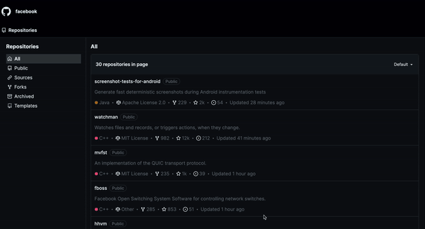

# Github Repositories Landing Page Challenge



The frontend web application is a Github clone developed with [Next.js](https://nextjs.org/), [Zustand](https://zustand-demo.pmnd.rs/), [TypeScript](https://www.typescriptlang.org/) and [Tailwind CSS](https://tailwindui.com/) as core technologies. Its purpose is to display a list of repositories and their details based on a specific organization, in this case, Facebook. The application content data was consumed through the [Github API Rest](https://docs.github.com/es/rest?apiVersion=2022-11-28).

## Table of content

- [Deployment](#deployment)
- [Features](#features)
- [Settings](#settings)
- [Installation](#installation)
- [How to build](#how-to-build)
- [Project structure](#project-structure)
- [Scalability considerations](#scalability-considerations)
- [Conclusion](#conclusion)
- [Contact](#contact)
- [Bonus](#bonus)
- [License](#license)

## Deployment

This app was deployed on [Amazon S3 (Simple Storage Service)](https://aws.amazon.com/es/s3/) and [Amazon Cloudfront](https://aws.amazon.com/es/cloudfront/). You can do live tests at the following link.

http://d40nwhaxs1dz1.cloudfront.net/?type=all

## Features

_Fetch and display repositories:_ The landing page fetches and displays a list of repositories from a specified Github organization.

_Responsive design:_ The page is designed to be responsive and work well on various devices.

_Clean and structured code:_ The solution is designed with modularity and reusability in mind.

## Settings

If you want to run the app locally you need to config the environment variables as first step:

```bash
# Create a .env file in the project root with the following variables

NEXT_PUBLIC_API_URL=https://api.github.com
NEXT_PUBLIC_GITHUB_TOKEN=<your-github-token>
NEXT_PUBLIC_GITHUB_API_ORG=facebook
NEXT_PUBLIC_GITHUB_API_VERSION=2022-11-28
NEXT_PUBLIC_GITHUB_API_ACCEPT=application/vnd.github+json
```

These variables are mainly used for API authentication handling. [Read more about Github API Rest Authentication](https://docs.github.com/es/rest/authentication/authenticating-to-the-rest-api?apiVersion=2022-11-28).

## Installation

- ### Prerequisites
For better performance I highly recommend you:

Node.js (v20.x or higher)

npm (v10.x or higher)

```bash
# Clon the repository
git clone https://github.com/cbasJS/frontend_challenge.git

# Go to the folder
cd github-clone-app

# Install the dependencies
npm install

# Run locally
npm run dev
```

## How to build

```bash
# Compile the project
npm run build

# Run the server
npm reun start
```

## Project structure

The structure of this application was made based on [Clean Architecture](https://blog.cleancoder.com/uncle-bob/2012/08/13/the-clean-architecture) and [SOLID principles](https://www.freecodecamp.org/espanol/news/los-principios-solid-explicados-en-espanol/).

```bash
github-clone-app/
├── app/
│   ├── application/
│   ├── domain/
│   ├── infrastructure/
│   ├── presentation/
│   ├── favicon.icon
│   └── globals.css
├── pages/
├── public/
├── .env
├── .env.template
├── .eslintrc.json
├── .gitignore
├── github-lang-colors.json
├── next.config.mjs
├── package-lock.json
├── package.json
├── postcss.config.mjs
├── tailwind.config.js
└── tsconfig.json
```

### Main folders and files
- _app/application:_ Zustand config for global state management.

- _app/domain:_ TypeScript type definitions to ensure typed development and avoid common errors.

- _app/infrastructure:_ Services for interaction with the Github API.

- _app/presentation:_ Reusable React components for the UI.

- _/pages:_ Contains the application pages, taking advantage of Next.js file-based routing.

## Scalability Considerations

If this application needed to be scaled, here are some improvements that could be made:

### 1. Application Optimization

A. Server-Side Rendering (SSR) and Static Site Generation (SSG)

- _SSR:_ Use Server-Side Rendering for pages that require dynamic data on each request.

- _SSG:_ Use Static Site Generation for pages that do not change frequently, generating static pages at build time.

B. Minification and Compression

- Ensure CSS and JavaScript files are minified.

- Use gzip or Brotli compression to reduce the size of files sent to clients.

### 2. Traffic Management and Scalability

A. Horizontal Scalability

- _Auto Scaling:_ Use Auto Scaling groups in AWS to automatically handle increases in traffic.

- _Load Balancer:_ Implement a Load Balancer (Elastic Load Balancer) to distribute traffic across multiple instances.

B. Caching and CDN

- _Caching in CloudFront_: Configure cache policies in CloudFront to reduce load on the origin server and improve response times.

### 3. Monitoring and Maintenance

A. Monitoring

- Use monitoring tools like Sentry to monitor the application's performance.

- Set up Google Analytics to visualize key metrics.

B. Maintenance

- Perform regular stress testing to identify and address bottlenecks.

- Ensure regular updates of dependencies and security patches.

## Conclusion

This project demonstrates the ability to create a functional, well-documented, and scalable web application. I hope you enjoy reviewing it as much as I enjoyed building it!

## Contact

For any questions or further information, please contact:

- [LinkedIn](https://www.linkedin.com/in/sebastian-martha-963877152/)

## Bonus

I created a small application with the MERN Stack for an authentication form. Please check the [_/auth-formulary_](https://github.com/cbasJS/frontend_challenge/tree/main/auth-formulary) folder to learn more.

## License

This project is under the ISC License.