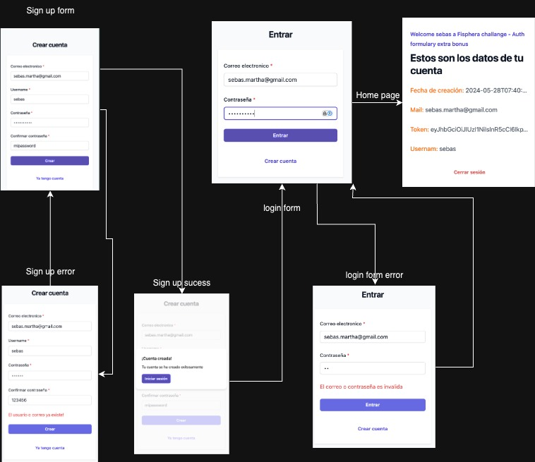

# Auth formulary APP

This is a small sample of developing a login flow through a web application.

The application was fully developed using the [MERN Stack](https://www.mongodb.com/resources/languages/mern-stack). The purpose of this development is to demonstrate my extensive knowledge in web development (frontend and backend).

In addition, the entire project was developed under [Clean Architecture](https://blog.cleancoder.com/uncle-bob/2012/08/13/the-clean-architecture.html) and [SOLID principles](https://www.digitalocean.com/community/conceptual-articles/s-o-l-i-d-the-first-five-principles-of-object-oriented-design) for better management at the code level and to be able to scale the app in a simple way.

## Where is deployed?

This client developed with React was deployed to an [AWS S3](https://aws.amazon.com/es/s3/) bucket. You can do live tests through the following link:

`http://finphera.auth-formulary.s3-website-us-west-2.amazonaws.com/`

## Description

You can find more information about the backend and frontend project in their respective folders.

## Screen Flow

1. ### Registration Screen

- Description: Allows users to create a new account by providing a username, email, and password.
- Flow:
  1. The user completes the registration form.
  2. The user submits the form.
  3. If the registration is successful, the user is redirected to the login screen.

2. ### Login Screen

- Description: Allows users to log in with their email and password.
- Flow:
  1. The user enters their login credentials.
  2. The user submits the form.
  3. If the login is successful, the user is redirected to the home screen.

3. ### Home Screen

- Description: A protected page that can only be accessed by authenticated users.
- Flow:

  1. The authenticated user can view their personal information and access additional functionality.

  2. If the user is not authenticated, they are redirected to the login screen.

